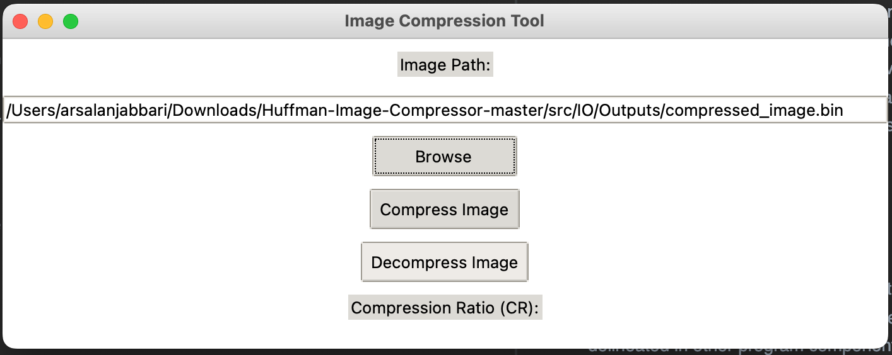
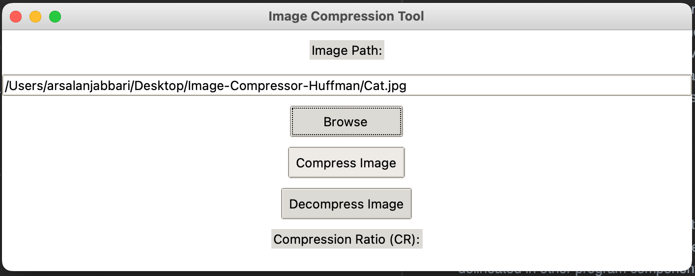

## Image-Compressor-Huffman
Amid the modern digital landscape, efficient image compression holds utmost importance due to the pivotal role of images in contemporary documents and applications. The challenge stems from the significant storage space raw images occupy, prompting the need for adept compression techniques. This project addresses this challenge by introducing a novel, efficient lossless compression method using Huffman coding. This method not only simplifies implementation but also reduces memory consumption, making it well-suited for resource-limited environments and aiming to revolutionize streamlined image data management.

### Table of Contents
- [Introduction](#introduction)
- [Project Overview](#project-overview)
- [Features](#features)
- [Getting Started](#getting-started)
- [Conclusion](#conclusion)

### Introduction
In an era saturated with visual content, optimizing data management is imperative. This project pioneers a journey to revolutionize image data handling using compression. Images, vital to modern documents and applications, inherently strain storage. To counter this, the project implements a lossless image compression technique, rooted in Huffman coding.

The project's core aim is to reduce redundant information in images, enabling efficient storage and transmission. By adopting lossless methods, critical details are preserved during compression. Huffman coding, known for its efficiency and simplicity, plays a central role, optimizing memory use and computational complexity. This project amalgamates innovation with established techniques, introducing a transformative image data management paradigm. As the project delves into Huffman coding's mechanics, its potential to catalyze effective compression and decompression becomes evident, reshaping the digital landscape.

### Project Overview
- **main.py**!
The "main.py" file serves as the program's point of entry. It accepts the input image path and orchestrates the invocation of functions delineated in other program components. These functions culminate in the compression and subsequent decompression of the image content via the application of Huffman coding principles.

- **huffman_coding.py**:
The "huffman_coding.py" module embodies a suite of functions dedicated to the meticulous enactment of Huffman coding. These functions encompass the computation of byte frequencies within the input image, the construction of the Huffman tree, the derivation of Huffman codes, and the establishment of byte-to-code associations. Through this set of algorithms, the essence of Huffman coding is realized, optimizing data representation with consideration for symbol frequency distribution.

- **binary_data_handler.py**:
The "binary_data_handler.py" module is instrumental in the management of binary data. Within its ambit, functions are consigned to the aegis of reading and writing image files. In the former role, binary data is ingested from the input image, while the latter is exemplified by the composition of compressed or decompressed image content into an output file. This facet of the program augments its capacity for manipulative data transformations.
### Features
The Huffman Coding Image Compression Tool is a user-friendly application designed to efficiently compress and decompress image data using the Huffman coding algorithm. This tool offers several features that make it a powerful and intuitive solution for managing image compression:

- **Huffman Coding Abilities**:
Utilizing the Huffman coding algorithm, the tool intelligently encodes image data, replacing frequently occurring patterns with shorter codes and optimizing the data representation. This results in significantly reduced file sizes, making the tool suitable for conserving storage space and facilitating faster data transmission.

- **Compression Principles**:
The tool implements Huffman coding, a lossless compression technique that assigns shorter codes to more frequent symbols and longer codes to less frequent symbols. By capitalizing on the statistical distribution of symbols in the input data, the tool achieves efficient compression without any loss of information. This makes it particularly useful for scenarios where image quality preservation is crucial.

- **Graphical User Interface (GUI)**:
The tool boasts an intuitive graphical user interface that simplifies the compression and decompression process. Users can easily navigate through the application's functions, making it accessible even to individuals with limited technical knowledge. The GUI allows users to interact with the tool's features seamlessly, enhancing the overall user experience.

- **User-Friendly Operation**:
Whether you're a casual user or a professional, the Huffman Coding Image Compression Tool offers a straightforward workflow. Users can effortlessly select image files, trigger compression, and visualize the compressed image output. Similarly, the decompression process is equally user-friendly, allowing users to efficiently restore the original image from the compressed data.

- **Optimized Storage and Transmission**:
By effectively reducing the size of image files, the tool contributes to optimizing storage utilization. Compressed images require less disk space, facilitating the management of image libraries and archives. Additionally, the smaller file sizes enable faster data transmission over networks, enhancing efficiency in data sharing and distribution.

- **File Preservation*8:
One of the standout features of Huffman coding is its lossless nature, ensuring that no data is compromised during compression and decompression. This makes the tool suitable for applications where image fidelity and data integrity are paramount, such as medical imaging, archival purposes, and scientific data analysis.
### Getting Started
This tool allows you to compress and decompress image data using the Huffman coding algorithm. Follow these steps to get started:
- **Step 1: Installation**
  - 1. Clone this repository to your local machine using the following command:
```git clone https://github.com/arsalanjabbari/Image-Compressor-Huffman.git```
  - 2. Navigate to the repository's directory:
```cd Image-Compressor-Huffman.git```
- **Step 2: Dependencies**

  - 1. Make sure you have Python 3.x installed on your machine.
  - 2. Install any required dependencies by running.
- **Step 3: Using the Tool**
  - 1. Launch the tool by running: ```python main.py```
  - 2. Compress an Image:
Click on the "Compress" button in the GUI.
Select the image you want to compress.
The tool will process the image using the Huffman coding algorithm and display the compressed image output.
  - 3. Decompress an Image:
Click on the "Decompress" button in the GUI.
Select the compressed image file you want to decompress.
The tool will restore the original image from the compressed data and display the decompressed image output.
- **Step 4: Additional Features**

  - Huffman Codes:
The tool generates Huffman codes for each symbol during compression. You can find these codes in the "huffman_codes.txt" file in the "IO/Outputs" directory.
### Conclusion
In conclusion, this project highlights the transformative potential of the Huffman coding method for image compression, seamlessly bridging the gap between traditional techniques and modern data management challenges. By skillfully implementing a lossless compression and decompression approach, the project addresses the intricate balance between preserving image fidelity and optimizing storage efficiency. The demonstrated synergy between established methodologies and contemporary innovation underscores the project's success in meeting the evolving demands of efficient image data utilization. As the digital landscape continues to evolve, the project's adept utilization of Huffman coding serves as a testament to the enduring relevance of this technique, poised to shape the future of image compression and data management.
